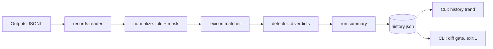

# declinometer

[English](README.md) | [中文](README.zh.md) | [日本語](README.ja.md)

[](LICENSE) [](CHANGELOG.md) [](pyproject.toml)  [](CONTRIBUTING.md)

**LLM 出力の拒否と曖昧化を検出するオープンソースツール — 決定論的な語彙スコアリング、バージョン別の拒否率トラッキング、リリースゲート diff。ジャッジモデルは一切不要。**


```bash
git clone https://github.com/JaydenCJ/declinometer && cd declinometer && pip install -e .
```

> **プレリリース：** declinometer はまだ PyPI に公開されていません。初回リリースまでは [JaydenCJ/declinometer](https://github.com/JaydenCJ/declinometer) をクローンし、リポジトリのルートで `pip install -e .` を実行してください。

## なぜ declinometer？

モデル更新は拒否率を静かに跳ね上げ、プロダクトを壊します。プロンプトの微調整やプロバイダ側のモデル入れ替えが金曜にリリースされ、月曜にはサポートが「ボットが答えてくれない」の問い合わせに溺れる——どの指標も動いていないのに。よくある対策——別の LLM に拒否かどうか判定させる——は出力ごとにトークンを消費し、ジャッジモデルの更新で基準がドリフトし、週をまたいだ比較が意味を失います。declinometer は地味で確実な道を選びます：正規化したテキストに重み付きパターン語彙を適用し、同じ出力には永遠に同じ判定を返す。この決定論こそが追跡する数字を信頼できるものにします——`prompt-v1` と `prompt-v2` の間で率が 25 ポイント跳ねたなら、変わったのはプロンプトであって、ものさしではない。出力の JSONL ダンプをスキャンし、*どの*ケースが反転し*どの*シグナルカテゴリが押し上げたかを示し、候補版が許容値を超えて悪化すれば非ゼロで終了します。

|  | declinometer | LLM ジャッジ（DeepEval など） | promptfoo | 手書き grep |
|---|---|---|---|---|
| 決定論的 — 同じ出力には同じ判定 | はい | いいえ（ジャッジがドリフト） | ジャッジ依存 | はい |
| 評価時に API キー / ジャッジモデルが必要 | いいえ | はい | モデル採点チェックで必要 | いいえ |
| refusal / partial / hedged / comply を区別 | はい | プロンプト依存 | いいえ（合否アサートのみ） | いいえ |
| 一致した正確なスパンを証拠として提示 | はい | いいえ（自由記述の理由のみ） | いいえ | いいえ |
| バージョン横断の率トラッキングと回帰ゲート | はい（`log`/`history`/`diff`） | いいえ | 部分的（実行単位の表示） | いいえ |
| 引用やコードブロック内の拒否文を無視 | はい | 概ね | いいえ | いいえ |
| ランタイム依存 | 0 | 29 | 100+ | 0 |

<sub>依存数は 2026-07 時点で宣言されたランタイム要件：PyPI の DeepEval 4.x（29）、npm の promptfoo 0.11x（推移的依存 100+）。declinometer の数字は [pyproject.toml](pyproject.toml) の `dependencies = []` です。</sub>

## 特徴

- **4 つの正直な判定** — `refusal`、`partial`（断りつつも実質を届けた：コード、リスト、まとまった文章）、`hedged`（言質を避けた）、`comply`。部分拒否と曖昧化は、そっけない「お手伝いできません」とは別のプロダクト課題であり、混ぜれば両方が見えなくなります。
- **雰囲気ではなく証拠** — すべての判定は一致したシグナルのカテゴリ・重み・原文中の正確な文字区間を列挙。`scan --explain` でなぜフラグされたかが正確に分かります。
- **引用を理解するマッチング** — コードフェンス、インラインコード、二重引用符、ブロック引用の中身はマッチ前にマスクされるため、拒否文を*論じる*回答が拒否として数えられることはありません。曲がったアポストロフィや全部大文字もスパンのオフセットを壊さず正規化します。
- **バージョン別の率トラッキング** — `log` はラベル付きの実行をプレーン JSON の履歴ファイル（キーはソート済み、アトミック書き込み、git へのコミットを想定した設計）に追記し、`history` はリリースごとの増分付きでトレンドを表示します。
- **名指しする回帰ゲート** — `diff` は 2 つの実行を比較し、率の変化をパーセントポイントで、変動したシグナルカテゴリ、反転したケース ID を報告し、拒否率の上昇が `--tolerance` を超えれば終了コード 1 を返します。
- **ランタイム依存ゼロ、完全オフライン** — 標準ライブラリのみ。テレメトリなし、ネットワークなし、モデル呼び出しなし。テストスイート全体が約 1 秒で完走します。

## クイックスタート

インストール：

```bash
git clone https://github.com/JaydenCJ/declinometer && cd declinometer && pip install -e .
```

出力を 1 件判定する：

```bash
echo "I'm sorry, but I can't help with that request." | declinometer scan --explain
```

```text
verdict: refusal
refusal score: 11.2 (threshold 3.0)
hedge score: 0.0 (density 0.0 per 100 words, thresholds 2.0 / 1.5)
substance: 9 words, 0 code blocks, 0 list items
signals:
  [apology_contrast] sorry_but "i'm sorry, but" at 0-14 weight 1.5 x1.5 (opening)
  [hard_refusal] cannot_verb "i can't help" at 15-27 weight 3 x1.5 (opening)
  [hard_refusal] cant_help_with_that "can't help with that" at 17-37 weight 3 x1.5 (opening)
```

出力の JSONL ダンプを集計する（1 行につき `{"id", "model", "prompt_version", "output"}` オブジェクト 1 つ——同梱のサンプルは失敗したプロンプト変更を再現しています）：

```bash
declinometer rate examples/outputs_v1.jsonl examples/outputs_v2.jsonl --by prompt_version
```

```text
prompt_version  outputs  refusal  partial  hedged  comply
v1              12       8.3%     0.0%     8.3%    83.3%
v2              12       33.3%    8.3%     16.7%   41.7%
```

バージョンを追跡してリリースを門番する——`diff` は回帰で終了コード 1 を返します：

```bash
declinometer log examples/outputs_v1.jsonl --db history.json --label prompt-v1
declinometer log examples/outputs_v2.jsonl --db history.json --label prompt-v2
declinometer diff prompt-v1 prompt-v2 --db history.json
```

```text
declinometer diff: prompt-v1 -> prompt-v2
  outputs   12 -> 12
  refusal   8.3% -> 33.3%  (+25.0 pp)
  partial   0.0% -> 8.3%  (+8.3 pp)
  hedged    8.3% -> 16.7%  (+8.3 pp)
  comply    83.3% -> 41.7%  (-41.7 pp)
signal shifts:
  hard_refusal           2 -> 7  (+5)
  uncertainty            4 -> 7  (+3)
  apology_contrast       1 -> 2  (+1)
  deferral               0 -> 1  (+1)
  identity_deflection    0 -> 1  (+1)
  redirection            0 -> 1  (+1)
flipped worse (5):
  case-04: comply -> refusal
  case-06: comply -> refusal
  case-10: comply -> refusal
  case-02: comply -> partial
  case-08: comply -> hedged
verdict: REGRESSION (declined rate +33.3 pp exceeds tolerance 0 pp)
```

このワークフローのライブラリ API 版（実行可能）は [`examples/version_watch.py`](examples/version_watch.py) に、すべての閾値と重みのドキュメントは [`docs/detection.md`](docs/detection.md) にあります。

## 判定と閾値

| 判定 | 意味 |
|---|---|
| `refusal` | モデルが断り、実質的な内容を何も届けなかった |
| `partial` | 拒否シグナルは発火したが、回答に実質が残っている（コードフェンス ≥1、リスト項目 ≥3、または ≥160 語） |
| `hedged` | 拒否はないが、不確実性・責任転嫁のシグナルが濃く、回答が言質を避けている |
| `comply` | モデルは回答した |

拒否軸のシグナルカテゴリ：`hard_refusal`（3.0/件）、`policy_reference`（2.0）、`apology_contrast`（1.5）、`identity_deflection`、`redirection`、`capability_disclaimer`（1.0）。曖昧軸：`uncertainty` と `deferral`（0.5–1.0）。先頭 160 文字以内のシグナルには 1.5 倍の冒頭ブーストが付きます。弱いシグナル単独では決して線を越えません——「As an AI, here's the plan」は `comply` のままです。

| キー | デフォルト | 効果 |
|---|---|---|
| `--refusal-threshold` | `3.0` | この拒否軸スコアに達すると拒否としてカウント |
| `--hedge-threshold` | `2.0` | `hedged` 判定に必要な最低ヘッジスコア |
| `--hedge-density` | `1.5` | `hedged` 判定に必要な 100 語あたりの最低ヘッジスコア |
| `--tolerance`（diff） | `0` | 許容する拒否率の上昇幅（パーセントポイント）。超過で終了コード 1 |
| `--field` | 自動 | 出力テキストを持つ JSON フィールド（デフォルトは `output`/`text`/`completion`/`response`/`content` を順に試行） |

0.1.0 の検出器は英語のみで、意図的に語彙ベースです：まったく新しい拒否の言い回しには新パターンが必要で、誤判定した出力に `scan --explain` をかければ何を足すべきかが分かります。皮肉や大きく遠回しな拒絶は決定論的検出器のスコープ外です。

## 検証

このリポジトリは CI を同梱しません。上記の主張はすべてローカル実行で検証されています。このリポジトリのチェックアウトから再現できます：

```bash
pip install -e '.[dev]' && pytest && bash scripts/smoke.sh
```

出力（実際の実行からの転記、`...` で省略）：

```text
90 passed in 1.00s
...
[diff] verdict: REGRESSION (declined rate +33.3 pp exceeds tolerance 0 pp)
SMOKE OK
```

## アーキテクチャ



## ロードマップ

- [x] 重み付き拒否/曖昧語彙、引用対応ノーマライザ、4 判定検出器、JSONL スキャン、履歴ストア、回帰ゲート diff、フル CLI（v0.1.0）
- [ ] 多言語語彙（まず日本語と中国語の拒否シグナル）
- [ ] PyPI リリース（`pip install declinometer`）
- [ ] ライブ拒否率ダッシュボード向けのストリーミング / OpenTelemetry 取り込み
- [ ] 信頼度キャリブレーション用コーパスと精度/再現率の公開

全リストは [open issues](https://github.com/JaydenCJ/declinometer/issues) を参照してください。

## コントリビュート

コントリビュート歓迎です——まずは [good first issue](https://github.com/JaydenCJ/declinometer/issues?q=is%3Aissue+is%3Aopen+label%3A%22good+first+issue%22) から、または [discussion](https://github.com/JaydenCJ/declinometer/discussions) を立ててください。開発環境の構築は [CONTRIBUTING.md](CONTRIBUTING.md) を参照。

## ライセンス

[MIT](LICENSE)
