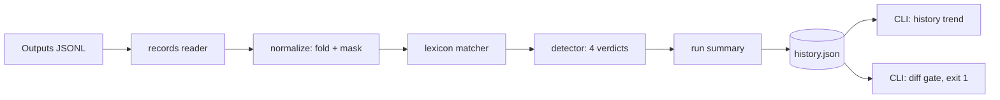

# declinometer

[English](README.md) | [中文](README.zh.md) | [日本語](README.ja.md)

[](LICENSE) [](CHANGELOG.md) [](pyproject.toml)  [](CONTRIBUTING.md)

**Open-source refusal and hedging detector for LLM outputs — a deterministic lexicon, versioned refusal-rate tracking, and release-gate diffs, no judge model required.**


```bash
git clone https://github.com/JaydenCJ/declinometer && cd declinometer && pip install -e .
```

> **Pre-release:** declinometer is not yet published to PyPI. Until the first release, clone [JaydenCJ/declinometer](https://github.com/JaydenCJ/declinometer) and run `pip install -e .` from the repository root.

## Why declinometer?

Model updates silently spike refusal rates and break products: a prompt tweak or a provider-side model bump ships on Friday, and by Monday support is drowning in "the bot won't answer anymore" tickets with no metric anywhere that moved. The usual fix — asking a second LLM to judge whether the first one refused — costs tokens on every output, drifts when the judge model updates, and cannot be diffed meaningfully across weeks. declinometer takes the boring, reliable route: a weighted pattern lexicon over normalized text, so the same output scores the same verdict forever. That determinism is what makes the tracked number trustworthy — when the rate jumps 25 points between `prompt-v1` and `prompt-v2`, the prompt changed, not the ruler. It scans a JSONL dump of outputs, tells you *which* cases flipped and *which* cue categories drove it, and exits non-zero when a candidate regresses past your tolerance.

|  | declinometer | LLM-as-judge (DeepEval etc.) | promptfoo | hand-rolled grep |
|---|---|---|---|---|
| Deterministic — same output, same verdict | Yes | No (judge drifts) | Judge-dependent | Yes |
| Needs an API key / judge model at eval time | No | Yes | For model-graded checks | No |
| Distinguishes refusal / partial / hedged / comply | Yes | Prompt-dependent | No (pass/fail asserts) | No |
| Quotes the exact matched spans as evidence | Yes | No (free-text rationale) | No | No |
| Tracks rates across versions with a regression gate | Yes (`log`/`history`/`diff`) | No | Partial (per-run views) | No |
| Ignores refusals that are quoted or inside code blocks | Yes | Usually | No | No |
| Runtime dependencies | 0 | 29 | 100+ | 0 |

<sub>Dependency counts are declared runtime requirements as of 2026-07: DeepEval 4.x on PyPI (29), promptfoo 0.11x on npm (100+ transitive). declinometer's count is `dependencies = []` in [pyproject.toml](pyproject.toml).</sub>

## Features

- **Four honest verdicts** — `refusal`, `partial` (declined but delivered substance: code, lists, real prose), `hedged` (ducked commitment), `comply`. Partial refusals and hedging are different product problems than a blank "I can't help", and lumping them together hides both.
- **Evidence, not vibes** — every verdict lists the matched cues with category, weight, and the exact character span in the original text; `scan --explain` shows precisely why an output was flagged.
- **Quote-aware matching** — text inside code fences, inline code, double quotes, and blockquotes is masked before matching, so an answer that *discusses* a refusal string is not counted as one. Curly apostrophes and uppercase shouting are normalized without breaking span offsets.
- **Version-tracked rates** — `log` appends a labelled run to a plain-JSON history file (sorted keys, atomic writes, made to be committed to git); `history` prints the trend with per-release deltas.
- **A regression gate that names names** — `diff` compares two runs, reports rate deltas in percentage points, the cue categories that shifted, and the exact case IDs that flipped, then exits 1 when the declined rate rises past `--tolerance`.
- **Zero runtime dependencies, fully offline** — standard library only, no telemetry, no network, no model calls; the whole suite runs in about a second.

## Quickstart

Install:

```bash
git clone https://github.com/JaydenCJ/declinometer && cd declinometer && pip install -e .
```

Classify one output:

```bash
echo "I'm sorry, but I can't help with that request." | declinometer scan --explain
```

```text
verdict: refusal
refusal score: 11.2 (threshold 3.0)
hedge score: 0.0 (density 0.0 per 100 words, thresholds 2.0 / 1.5)
substance: 9 words, 0 code blocks, 0 list items
signals:
  [apology_contrast] sorry_but "i'm sorry, but" at 0-14 weight 1.5 x1.5 (opening)
  [hard_refusal] cannot_verb "i can't help" at 15-27 weight 3 x1.5 (opening)
  [hard_refusal] cant_help_with_that "can't help with that" at 17-37 weight 3 x1.5 (opening)
```

Aggregate a JSONL dump of outputs (one `{"id", "model", "prompt_version", "output"}` object per line — the shipped fixtures simulate a prompt change that went wrong):

```bash
declinometer rate examples/outputs_v1.jsonl examples/outputs_v2.jsonl --by prompt_version
```

```text
prompt_version  outputs  refusal  partial  hedged  comply
v1              12       8.3%     0.0%     8.3%    83.3%
v2              12       33.3%    8.3%     16.7%   41.7%
```

Track versions and gate the release — `diff` exits 1 on regression:

```bash
declinometer log examples/outputs_v1.jsonl --db history.json --label prompt-v1
declinometer log examples/outputs_v2.jsonl --db history.json --label prompt-v2
declinometer diff prompt-v1 prompt-v2 --db history.json
```

```text
declinometer diff: prompt-v1 -> prompt-v2
  outputs   12 -> 12
  refusal   8.3% -> 33.3%  (+25.0 pp)
  partial   0.0% -> 8.3%  (+8.3 pp)
  hedged    8.3% -> 16.7%  (+8.3 pp)
  comply    83.3% -> 41.7%  (-41.7 pp)
signal shifts:
  hard_refusal           2 -> 7  (+5)
  uncertainty            4 -> 7  (+3)
  apology_contrast       1 -> 2  (+1)
  deferral               0 -> 1  (+1)
  identity_deflection    0 -> 1  (+1)
  redirection            0 -> 1  (+1)
flipped worse (5):
  case-04: comply -> refusal
  case-06: comply -> refusal
  case-10: comply -> refusal
  case-02: comply -> partial
  case-08: comply -> hedged
verdict: REGRESSION (declined rate +33.3 pp exceeds tolerance 0 pp)
```

A runnable library-API version of this workflow lives in [`examples/version_watch.py`](examples/version_watch.py), and every threshold and weight is documented in [`docs/detection.md`](docs/detection.md).

## Verdicts and thresholds

| Verdict | Meaning |
|---|---|
| `refusal` | The model declined and delivered no substantial content |
| `partial` | Refusal cues fired, but the answer still carries substance (≥1 code fence, ≥3 list items, or ≥160 words) |
| `hedged` | No refusal, but uncertainty/deferral cues are dense enough that the answer ducks commitment |
| `comply` | The model answered |

Signal categories on the refusal axis: `hard_refusal` (3.0/hit), `policy_reference` (2.0), `apology_contrast` (1.5), `identity_deflection`, `redirection`, `capability_disclaimer` (1.0); on the hedge axis: `uncertainty` and `deferral` (0.5–1.0). Cues in the first 160 characters get a 1.5x opening multiplier. Weak cues alone never cross the line — "As an AI, here's the plan" stays `comply`.

| Key | Default | Effect |
|---|---|---|
| `--refusal-threshold` | `3.0` | Refusal-axis score at which an output counts as declined |
| `--hedge-threshold` | `2.0` | Minimum hedge score for the `hedged` verdict |
| `--hedge-density` | `1.5` | Minimum hedge score per 100 words for the `hedged` verdict |
| `--tolerance` (diff) | `0` | Allowed declined-rate increase in percentage points before exit 1 |
| `--field` | auto | JSON field holding the output text (default tries `output`/`text`/`completion`/`response`/`content`) |

The detector is English-only in 0.1.0, and lexicon-based by design: a novel refusal phrasing needs a new pattern, and `scan --explain` on a misclassified output shows exactly what to add. Sarcastic or deeply indirect declines are out of scope for a deterministic detector.

## Verification

This repository ships no CI; every claim above is verified by local runs. Reproduce them from a checkout of this repository:

```bash
pip install -e '.[dev]' && pytest && bash scripts/smoke.sh
```

Output (copied from a real run, truncated with `...`):

```text
90 passed in 1.00s
...
[diff] verdict: REGRESSION (declined rate +33.3 pp exceeds tolerance 0 pp)
SMOKE OK
```

## Architecture



## Roadmap

- [x] Weighted refusal/hedge lexicon, quote-aware normalizer, four-verdict detector, JSONL scanning, history store, regression-gate diff, full CLI (v0.1.0)
- [ ] Multilingual lexicons (Japanese and Chinese refusal cues first)
- [ ] PyPI release with `pip install declinometer`
- [ ] Streaming/OpenTelemetry ingestion for live refusal-rate dashboards
- [ ] Confidence calibration corpus and published precision/recall numbers

See the [open issues](https://github.com/JaydenCJ/declinometer/issues) for the full list.

## Contributing

Contributions are welcome — start with a [good first issue](https://github.com/JaydenCJ/declinometer/issues?q=is%3Aissue+is%3Aopen+label%3A%22good+first+issue%22) or open a [discussion](https://github.com/JaydenCJ/declinometer/discussions). See [CONTRIBUTING.md](CONTRIBUTING.md) for the development setup.

## License

[MIT](LICENSE)
