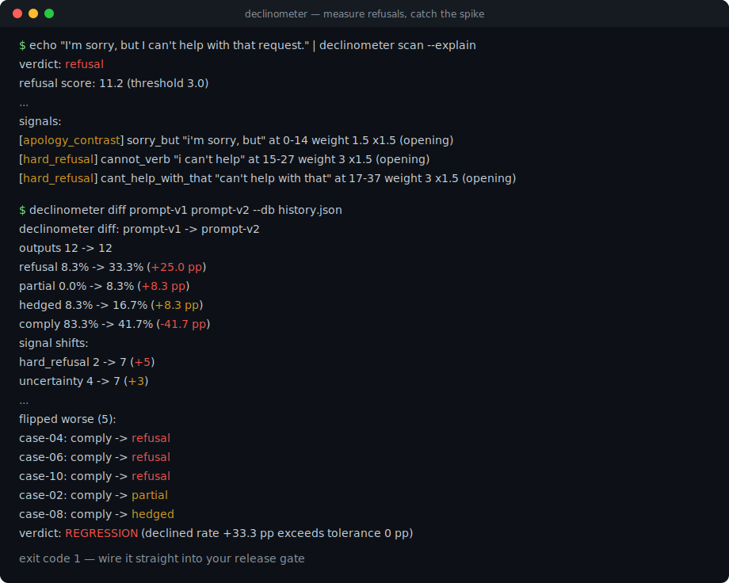
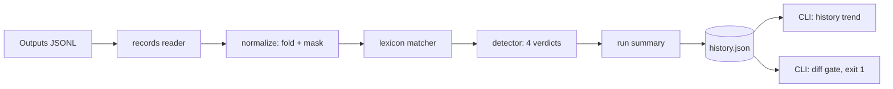

# declinometer

[English](README.md) | [中文](README.zh.md) | [日本語](README.ja.md)

[](LICENSE) [](CHANGELOG.md) [](pyproject.toml)  [](CONTRIBUTING.md)

**开源的 LLM 输出拒答与含糊检测器——确定性词典打分、按版本追踪拒答率、发布门禁 diff，全程无需裁判模型。**



```bash
git clone https://github.com/JaydenCJ/declinometer && cd declinometer && pip install -e .
```

> **预发布：** declinometer 尚未发布到 PyPI。在首个正式版之前，请克隆 [JaydenCJ/declinometer](https://github.com/JaydenCJ/declinometer) 并在仓库根目录执行 `pip install -e .`。

## 为什么选 declinometer？

模型更新会悄悄推高拒答率并弄坏产品：一次提示词微调或供应商侧的模型升级在周五上线，到周一客服就被"机器人不肯回答了"的工单淹没，而任何指标都没有动过。常见的补救——让第二个 LLM 判断第一个是否拒答——每条输出都烧 token，裁判模型一更新判据就漂移，跨周对比毫无意义。declinometer 走的是朴素可靠的路线：在归一化文本上运行加权模式词典，同一条输出永远得到同一个判定。正是这种确定性让被追踪的数字值得信赖——当拒答率在 `prompt-v1` 和 `prompt-v2` 之间跳升 25 个点时，变的是提示词，而不是尺子。它扫描输出的 JSONL 转储，告诉你*哪些*用例翻转了、*哪些*线索类别在推动，并在候选版本超出容差回归时以非零码退出。

|  | declinometer | LLM 裁判（DeepEval 等） | promptfoo | 手写 grep |
|---|---|---|---|---|
| 确定性——同一输出永远同一判定 | 是 | 否（裁判会漂移） | 取决于裁判 | 是 |
| 评估时需要 API key / 裁判模型 | 否 | 是 | 模型评分检查需要 | 否 |
| 区分 refusal / partial / hedged / comply | 是 | 取决于提示词 | 否（只有通过/失败断言） | 否 |
| 引用精确命中片段作为证据 | 是 | 否（自由文本理由） | 否 | 否 |
| 按版本追踪比率并带回归门禁 | 是（`log`/`history`/`diff`） | 否 | 部分（按次查看） | 否 |
| 忽略引号内或代码块里的拒答文本 | 是 | 通常可以 | 否 | 否 |
| 运行时依赖 | 0 | 29 | 100+ | 0 |

<sub>依赖数为 2026-07 时声明的运行时依赖：PyPI 上的 DeepEval 4.x（29），npm 上的 promptfoo 0.11x（传递依赖 100+）。declinometer 的数字即 [pyproject.toml](pyproject.toml) 中的 `dependencies = []`。</sub>

## 特性

- **四种诚实的判定** — `refusal`、`partial`（拒了但仍交付了实质内容：代码、列表、成段文字）、`hedged`（回避承诺）、`comply`。部分拒答和含糊其辞与干巴巴的"我帮不了"是不同的产品问题，混为一谈会把两者都藏起来。
- **证据，而非感觉** — 每个判定都列出命中线索的类别、权重和在原文中的精确字符区间；`scan --explain` 能准确展示一条输出为何被标记。
- **感知引用的匹配** — 代码围栏、行内代码、双引号和块引用中的文本在匹配前会被遮蔽，因此*讨论*拒答字符串的回答不会被算作拒答。弯引号和全大写咆哮会被归一化，且不破坏区间偏移。
- **按版本追踪的比率** — `log` 把带标签的一次运行追加到纯 JSON 历史文件（键排序、原子写入，就是为提交进 git 设计的）；`history` 打印带逐版本增量的趋势。
- **指名道姓的回归门禁** — `diff` 对比两次运行，以百分点报告比率变化、发生偏移的线索类别、翻转的具体用例 ID，并在拒答率涨幅超过 `--tolerance` 时以退出码 1 结束。
- **零运行时依赖，完全离线** — 只用标准库，无遥测、无网络、无模型调用；整个测试套件约一秒跑完。

## 快速上手

安装：

```bash
git clone https://github.com/JaydenCJ/declinometer && cd declinometer && pip install -e .
```

判定单条输出：

```bash
echo "I'm sorry, but I can't help with that request." | declinometer scan --explain
```

```text
verdict: refusal
refusal score: 11.2 (threshold 3.0)
hedge score: 0.0 (density 0.0 per 100 words, thresholds 2.0 / 1.5)
substance: 9 words, 0 code blocks, 0 list items
signals:
  [apology_contrast] sorry_but "i'm sorry, but" at 0-14 weight 1.5 x1.5 (opening)
  [hard_refusal] cannot_verb "i can't help" at 15-27 weight 3 x1.5 (opening)
  [hard_refusal] cant_help_with_that "can't help with that" at 17-37 weight 3 x1.5 (opening)
```

聚合输出的 JSONL 转储（每行一个 `{"id", "model", "prompt_version", "output"}` 对象——自带的样例模拟了一次改坏了的提示词变更）：

```bash
declinometer rate examples/outputs_v1.jsonl examples/outputs_v2.jsonl --by prompt_version
```

```text
prompt_version  outputs  refusal  partial  hedged  comply
v1              12       8.3%     0.0%     8.3%    83.3%
v2              12       33.3%    8.3%     16.7%   41.7%
```

追踪版本并把住发布关口——`diff` 在回归时以退出码 1 结束：

```bash
declinometer log examples/outputs_v1.jsonl --db history.json --label prompt-v1
declinometer log examples/outputs_v2.jsonl --db history.json --label prompt-v2
declinometer diff prompt-v1 prompt-v2 --db history.json
```

```text
declinometer diff: prompt-v1 -> prompt-v2
  outputs   12 -> 12
  refusal   8.3% -> 33.3%  (+25.0 pp)
  partial   0.0% -> 8.3%  (+8.3 pp)
  hedged    8.3% -> 16.7%  (+8.3 pp)
  comply    83.3% -> 41.7%  (-41.7 pp)
signal shifts:
  hard_refusal           2 -> 7  (+5)
  uncertainty            4 -> 7  (+3)
  apology_contrast       1 -> 2  (+1)
  deferral               0 -> 1  (+1)
  identity_deflection    0 -> 1  (+1)
  redirection            0 -> 1  (+1)
flipped worse (5):
  case-04: comply -> refusal
  case-06: comply -> refusal
  case-10: comply -> refusal
  case-02: comply -> partial
  case-08: comply -> hedged
verdict: REGRESSION (declined rate +33.3 pp exceeds tolerance 0 pp)
```

这条工作流的库 API 可运行版本在 [`examples/version_watch.py`](examples/version_watch.py)，全部阈值与权重的文档在 [`docs/detection.md`](docs/detection.md)。

## 判定与阈值

| 判定 | 含义 |
|---|---|
| `refusal` | 模型拒绝了，且没有交付实质内容 |
| `partial` | 拒答线索命中，但回答仍有实质内容（≥1 个代码围栏、≥3 个列表项或 ≥160 词） |
| `hedged` | 没有拒答，但不确定/推诿线索密集到回答在回避承诺 |
| `comply` | 模型作答了 |

拒答轴上的线索类别：`hard_refusal`（3.0/次）、`policy_reference`（2.0）、`apology_contrast`（1.5）、`identity_deflection`、`redirection`、`capability_disclaimer`（1.0）；含糊轴上：`uncertainty` 与 `deferral`（0.5–1.0）。前 160 个字符内的线索获得 1.5 倍开头加成。弱线索单独永远过不了线——"As an AI, here's the plan" 仍是 `comply`。

| 键 | 默认值 | 作用 |
|---|---|---|
| `--refusal-threshold` | `3.0` | 拒答轴得分达到该值即计为拒答 |
| `--hedge-threshold` | `2.0` | `hedged` 判定所需的最低含糊得分 |
| `--hedge-density` | `1.5` | `hedged` 判定所需的每 100 词最低含糊得分 |
| `--tolerance`（diff） | `0` | 允许的拒答率涨幅（百分点），超过则退出码 1 |
| `--field` | 自动 | 存放输出文本的 JSON 字段（默认依次尝试 `output`/`text`/`completion`/`response`/`content`） |

0.1.0 的检测器仅支持英文，且刻意基于词典：全新的拒答措辞需要新增模式，对误判输出跑一次 `scan --explain` 就能看出该加什么。讽刺或高度迂回的拒绝不在确定性检测器的范围内。

## 验证

本仓库不带 CI；以上每一条主张都由本地运行验证。从本仓库的检出即可复现：

```bash
pip install -e '.[dev]' && pytest && bash scripts/smoke.sh
```

输出（摘自真实运行，用 `...` 截断）：

```text
90 passed in 1.00s
...
[diff] verdict: REGRESSION (declined rate +33.3 pp exceeds tolerance 0 pp)
SMOKE OK
```

## 架构



## 路线图

- [x] 加权拒答/含糊词典、感知引用的归一化器、四判定检测器、JSONL 扫描、历史存储、回归门禁 diff、完整 CLI（v0.1.0）
- [ ] 多语言词典（优先日文与中文拒答线索）
- [ ] 发布到 PyPI，支持 `pip install declinometer`
- [ ] 流式 / OpenTelemetry 摄入，支撑实时拒答率看板
- [ ] 置信度校准语料与公开的精确率/召回率数据

完整列表见 [open issues](https://github.com/JaydenCJ/declinometer/issues)。

## 贡献

欢迎贡献——从一个 [good first issue](https://github.com/JaydenCJ/declinometer/issues?q=is%3Aissue+is%3Aopen+label%3A%22good+first+issue%22) 开始，或发起一个 [discussion](https://github.com/JaydenCJ/declinometer/discussions)。开发环境搭建见 [CONTRIBUTING.md](CONTRIBUTING.md)。

## 许可证

[MIT](LICENSE)
